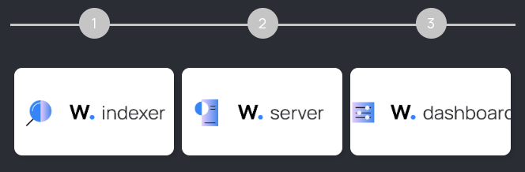

# Guia de Instalação

Neste guia de instalação, você aprenderá como instalar o Wazuh em sua infraestrutura. Também oferecemos o Wazuh Cloud , nossa solução de software como serviço (SaaS). O Wazuh Cloud está pronto para uso, sem a necessidade de hardware ou software adicional, reduzindo o custo e a complexidade. Consulte a documentação do serviço Wazuh Cloud para obter mais informações e aproveite a versão de teste do Wazuh Cloud para explorar este serviço.

## Instalando os componentes centrais do Wazuh

Você pode instalar o indexador Wazuh, o servidor Wazuh e o painel Wazuh em um único host ou distribuí-los em configurações de cluster. Cada componente central do Wazuh suporta dois métodos de instalação, e ambos fornecem instruções para instalar os componentes centrais em um único host ou em hosts separados.

Você pode consultar nossa documentação de Início Rápido para realizar uma instalação completa. Esta é a maneira mais rápida de colocar os componentes centrais do Wazuh em funcionamento.

Para maior flexibilidade e personalização de implantação, instale os componentes centrais do Wazuh começando pela implantação do indexador do Wazuh . Este método de implantação oferece suporte tanto à instalação completa quanto à instalação de componentes em hosts separados.

Siga este fluxo de trabalho de instalação:

___
[< Instalação Rápida](Quickstart.md)  
[Instalação Indexador Wazuh >](Install_indexer.md)
