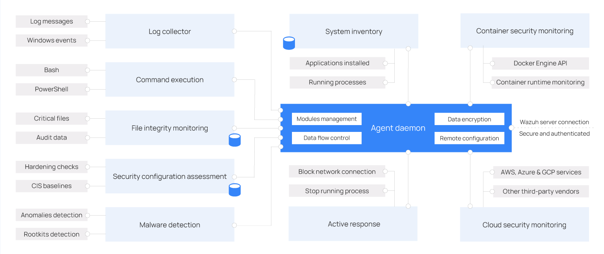

[Índice](Indice.md)  
___
## Conhecendo o Wazhu.

### Agente Wazuh

O agente Wazuh roda em Linux, Windows, macOS, Solaris, AIX e outros sistemas operacionais. Ele pode ser implantado em laptops, desktops, servidores, instâncias de nuvem, contêineres ou máquinas virtuais. O agente Wazuh ajuda a proteger seu sistema, fornecendo recursos de prevenção, detecção e resposta a ameaças. Ele também é usado para coletar diferentes tipos de dados do sistema e de aplicativos, que são encaminhados ao [servidor Wazuh](Wazuh_Server.md) por meio de um canal criptografado e autenticado.

O diagrama abaixo mostra a arquitetura e os módulos do agente.

#### Módulos do agente Wazuh

Todos os módulos do agente são configuráveis ​​e executam diferentes tarefas de segurança. Essa arquitetura modular permite que você configure cada módulo de acordo com suas necessidades de segurança. A lista a seguir resume as finalidades dos módulos do agente Wazuh.

* **Coletor de logs:** lê arquivos de log simples e eventos do Windows, coletando mensagens de log do sistema operacional e de aplicativos. Suporta filtros XPath para eventos do Windows e reconhece formatos multilinha, como logs de auditoria do Linux. Também pode enriquecer eventos JSON com metadados adicionais.

* **Execução de comandos:** executa comandos autorizados periodicamente, coletando seus resultados e reportando-os ao servidor Wazuh para análise posterior. Você pode usar este módulo para diferentes propósitos, como monitorar o espaço disponível em disco ou obter uma lista de usuários conectados recentemente.

* **Monitoramento de integridade de arquivos (FIM):** monitora o sistema de arquivos, informando quando os arquivos são criados, excluídos ou modificados. Ele monitora alterações nos atributos, permissões, propriedade e conteúdo dos arquivos. Quando um evento ocorre, ele captura detalhes sobre quem, o quê e quando em tempo real.

* **Avaliação de configuração de segurança (SCA):** fornece avaliação contínua de configuração, utilizando verificações prontas para uso com base nos benchmarks do Center of Internet Security (CIS). Os usuários também podem criar suas próprias verificações de SCA para monitorar e aplicar suas políticas de segurança.

* **Inventário do sistema:** executa varreduras periódicas para coletar dados de inventário, como versão do sistema operacional, interfaces de rede, processos em execução, aplicativos instalados e uma lista de portas abertas. Os resultados das varreduras são armazenados em bancos de dados SQLite locais que podem ser consultados remotamente.

* **Detecção de malware:** utiliza uma abordagem não baseada em assinatura para detectar anomalias e a possível presença de rootkits. Também procura processos, arquivos e portas ocultos, monitorando chamadas do sistema.

* **Resposta Ativa:** Executa ações automáticas quando ameaças são detectadas, acionando respostas para bloquear uma conexão de rede, interromper um processo em execução ou excluir um arquivo malicioso. Os usuários também podem criar respostas personalizadas quando necessário, por exemplo, respostas para executar um binário em uma sandbox, capturar tráfego de rede e verificar um arquivo com um antivírus.

* **Monitoramento de segurança de contêineres:** integra-se à API do Docker Engine para monitorar alterações em um ambiente em contêineres. Por exemplo, detecta alterações em imagens de contêineres, configuração de rede ou volumes de dados. Emite alertas sobre contêineres em execução em modo privilegiado e sobre usuários executando comandos em um contêiner em execução.

* **Monitoramento de segurança em nuvem:** monitora provedores de nuvem como Amazon Web Services, Microsoft Azure ou Google GCP, comunicando-se nativamente com suas APIs. Detecta alterações na infraestrutura de nuvem, por exemplo, quando um novo usuário é criado, um grupo de segurança é modificado ou uma instância de nuvem é interrompida. Além disso, coleta dados de log de serviços de nuvem, como AWS CloudTrail, GCP Pub/Sub e Azure Active Directory.

#### Comunicação com o servidor Wazuh

O agente Wazuh se comunica com o [servidor Wazuh](Wazuh_Server.md) para enviar dados coletados e eventos relacionados à segurança. O agente Wazuh também envia dados operacionais, relatando sua configuração e status. Uma vez conectado, o agente pode ser atualizado, monitorado e configurado remotamente a partir do servidor Wazuh.

A comunicação entre o agente Wazuh e o servidor Wazuh ocorre por meio de um canal seguro (TCP ou UDP), fornecendo criptografia e compactação de dados em tempo real. Além disso, inclui mecanismos de controle de fluxo para evitar inundações, enfileirar eventos quando necessário e proteger a largura de banda da rede.

Você precisa registrar o agente Wazuh antes de conectá-lo ao servidor Wazuh pela primeira vez. Este processo fornece ao agente uma chave exclusiva usada para autenticação e criptografia de dados.

___
[< Painel Wazuh](Wazuh_Indexer.md "Dashboard Wazuh")  
[Instalação rápida >](Instalacao_rapida.md "Instalação simplificada com todos componentes em único host")  