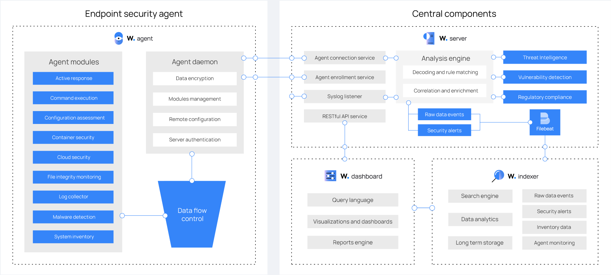

[Índice](Indice.md)  
___
## Conhecendo o Wazuh.

### Componentes.

A solução Wazuh é baseada no agente Wazuh, que é implantado nos endpoints monitorados, e em três componentes centrais: o servidor Wazuh, o indexador Wazuh e o painel Wazuh.

O [servidor Wazuh](Wazuh_Server.md) analisa os dados recebidos dos agentes. Ele os processa por meio de decodificadores e regras, utilizando inteligência de ameaças para procurar indicadores de comprometimento (IOCs) bem conhecidos. Um único servidor pode analisar dados de centenas ou milhares de agentes e escalar horizontalmente quando configurado como um cluster. Este componente central também é usado para gerenciar os agentes, configurando-os e atualizando-os remotamente quando necessário.

O [indexador Wazuh](Wazuh_Indexer.md) é um mecanismo de busca e análise de texto completo altamente escalável. Este componente central indexa e armazena alertas gerados pelo servidor Wazuh.

O [painel do Wazuh](Wazuh_Dashboard.md) é a interface de usuário web para visualização e análise de dados. Inclui painéis prontos para uso para detecção de ameaças, conformidade regulatória (por exemplo, PCI DSS, GDPR, CIS, HIPAA, NIST 800-53), detecção de aplicativos vulneráveis, dados de monitoramento de integridade de arquivos, resultados de avaliação de configuração, eventos de monitoramento de infraestrutura em nuvem e outros. Também é usado para gerenciar a configuração do Wazuh e monitorar seu status.

Os [agentes Wazuh](Wazuh_Agent.md) são instalados em endpoints como laptops, desktops, servidores, instâncias de nuvem ou máquinas virtuais. Eles fornecem recursos de prevenção, detecção e resposta a ameaças. São executados em sistemas operacionais como Linux, Windows, macOS, Solaris, AIX e HP-UX.

Além dos recursos de monitoramento baseados em agentes, a plataforma Wazuh pode monitorar dispositivos sem agentes, como firewalls, switches, roteadores ou IDS de rede, entre outros. Por exemplo, os dados de log de um sistema podem ser coletados via Syslog, e sua configuração pode ser monitorada por meio de sondagens periódicas de seus dados, via SSH ou por meio de uma API.

O diagrama abaixo representa os componentes do Wazuh e o fluxo de dados.

  

___
[< Introdução](README.md)  
[Servidor Wazuh >](Wazuh_Server.md)
