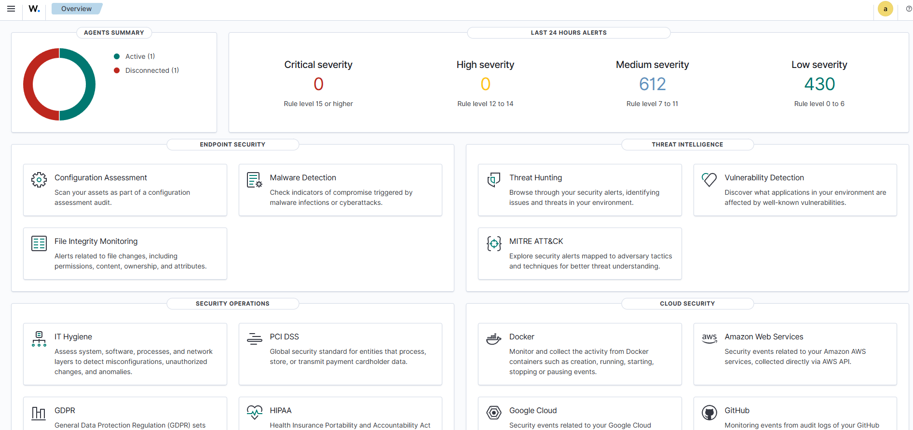
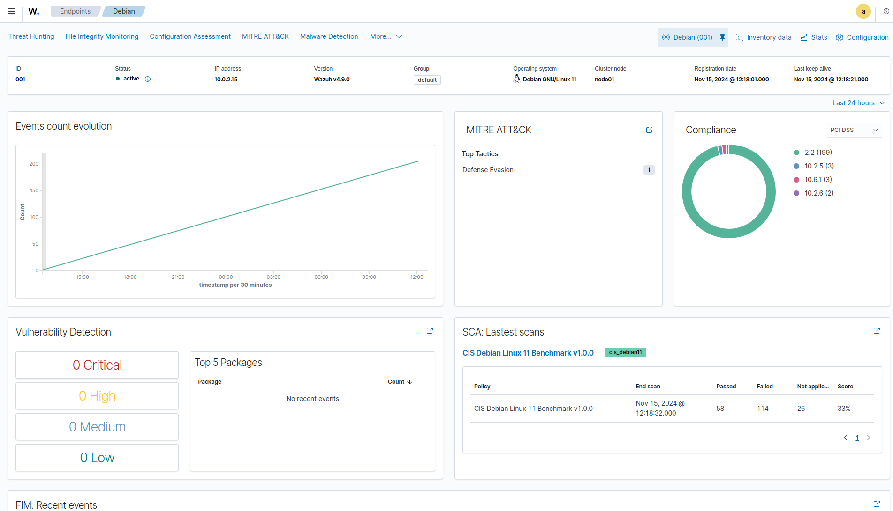
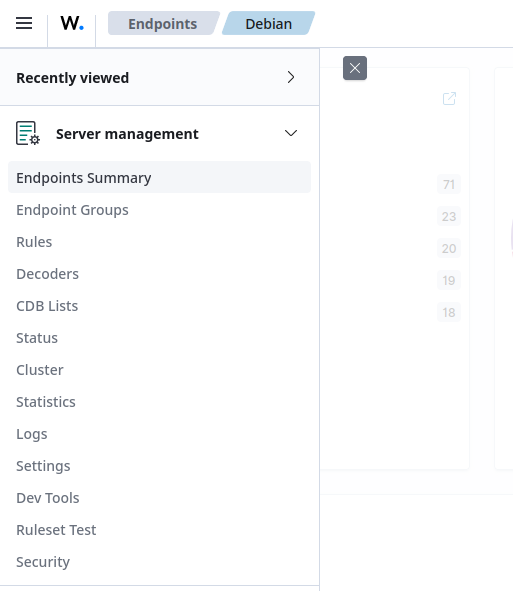
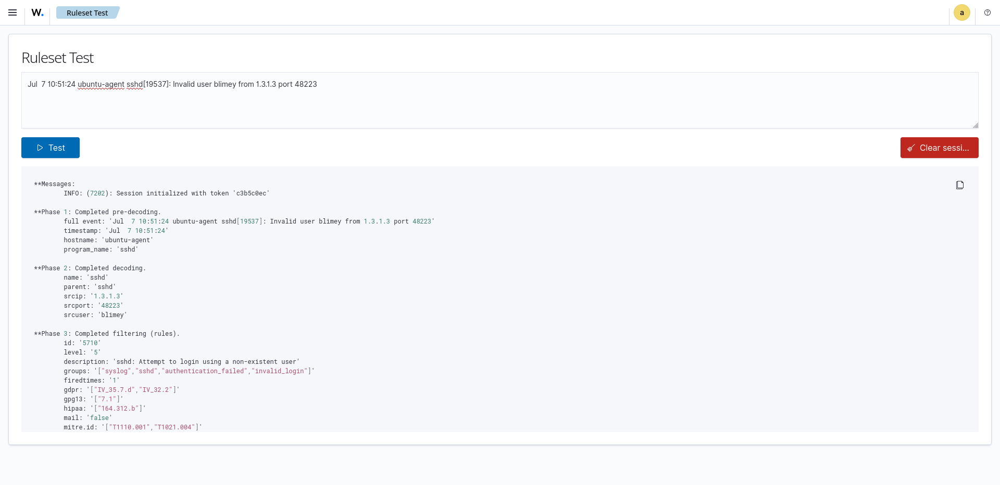
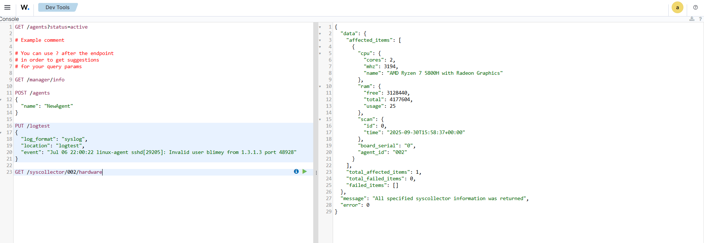
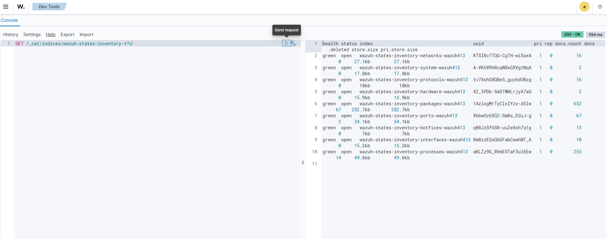

# Conhecendo o Wazhu

## Painel Wazuh

O painel Wazuh é uma interface web flexível e intuitiva para visualizar, analisar e gerenciar dados de segurança. Ele permite que os usuários investiguem eventos e alertas, supervisionem a plataforma Wazuh e apliquem políticas de controle de acesso baseado em função (RBAC) e logon único (SSO).

### Visualização e análise de dados

O painel do Wazuh permite que os usuários naveguem pelos dados de segurança coletados de dispositivos com e sem agente do Wazuh, além dos alertas gerados pelo servidor Wazuh. Ele inclui painéis para busca de ameaças, detecção de malware, monitoramento de integridade de arquivos, inventário do sistema e conformidade regulatória (por exemplo, PCI DSS, GDPR, HIPAA e NIST 800-53). Você pode gerar relatórios e criar visualizações e painéis personalizados.

### Monitoramento e configuração de agentes

O painel do Wazuh permite que os usuários gerenciem a configuração do agente e monitorem seu status. Para cada endpoint monitorado, os usuários podem definir quais módulos do agente serão habilitados, quais arquivos de log serão lidos, quais arquivos serão monitorados quanto a alterações de integridade e quais verificações de configuração serão realizadas.

#### Gestão de plataforma

O painel do Wazuh fornece uma interface de usuário para gerenciar uma implantação do Wazuh. Isso inclui monitorar o status, os logs e as estatísticas dos componentes do Wazuh, configurar o servidor Wazuh e criar regras e decodificadores personalizados para análise de logs e detecção de ameaças.

#### Ferramentas para desenvolvedores

O painel do Wazuh inclui uma ferramenta de teste de conjunto de regras que processa mensagens de log para mostrar como elas são decodificadas e se correspondem a uma regra de detecção. Isso é útil ao testar decodificadores e regras personalizados.

O painel do Wazuh também inclui consoles de API para interação com o servidor Wazuh e a API do indexador Wazuh. Eles são usados ​​para gerenciar os recursos do servidor Wazuh ou interagir com os índices do indexador Wazuh.

API do servidor Wazuh

API do indexador Wazuh

___
[< Indexador Wazuh](Wazuh_Indexer.md)  
[Agente Wazuh >](Wazuh_Agent.md)
