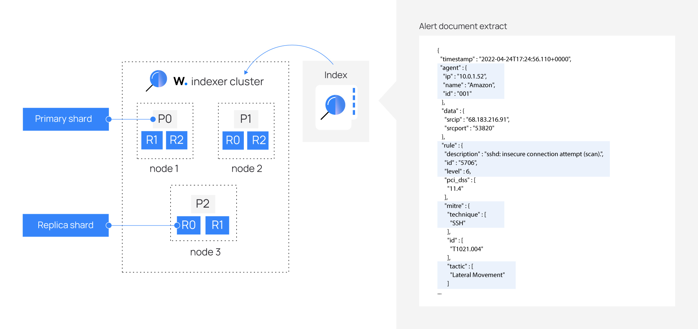

[Índice](Indice.md)  
___
## Conhecendo o Wazhu.

### Indexador Wazuh

O indexador Wazuh é um mecanismo de busca e análise de texto completo altamente escalável. Este componente central do Wazuh indexa e armazena alertas gerados pelo servidor Wazuh e fornece recursos de busca e análise de dados quase em tempo real. O indexador Wazuh pode ser configurado como um cluster de nó único ou de vários nós, proporcionando escalabilidade e alta disponibilidade.

O indexador Wazuh armazena dados como documentos JSON. Cada documento correlaciona um conjunto de chaves, nomes de campos ou propriedades com seus valores correspondentes, que podem ser strings, números, valores booleanos, datas, matrizes de valores, geolocalizações ou outros tipos de dados.

Um índice é uma coleção de documentos relacionados. Os documentos armazenados no indexador Wazuh são distribuídos em diferentes contêineres, conhecidos como shards. Ao distribuir os documentos entre vários shards e esses shards entre vários nós, o indexador Wazuh garante redundância. Isso protege seu sistema contra falhas de hardware e aumenta a capacidade de consulta à medida que nós são adicionados a um cluster.

Mostramos uma imagem do cluster do indexador Wazuh abaixo:

O Wazuh usa vários tipos de índices para armazenar diferentes tipos de eventos. Para mais detalhes, consulte a seção [Índices do indexador Wazuh](Wazug_indexer_indices.md) na documentação.

O indexador Wazuh é adequado para casos de uso com tempo limitado, como análise de segurança e monitoramento de infraestrutura, pois é uma plataforma de busca quase em tempo real. A latência entre o momento em que um documento é indexado e o momento em que se torna pesquisável é muito curta, normalmente um segundo.

Além de sua velocidade, escalabilidade e resiliência, o indexador Wazuh tem vários recursos integrados que tornam o armazenamento e a pesquisa de dados ainda mais eficientes, como consolidações de dados, alertas, detecção de anomalias e gerenciamento do ciclo de vida do índice.

___
[< Servidor Wazuh](Wazuh_Server.md)  
[Painel Wazuh >](Wazuh_Dashboard.md)  